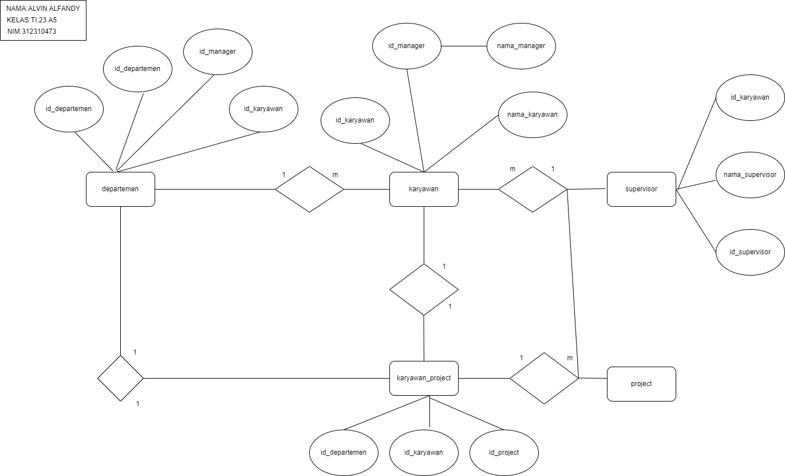
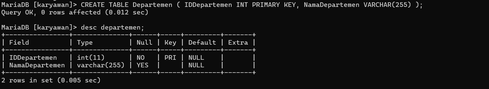
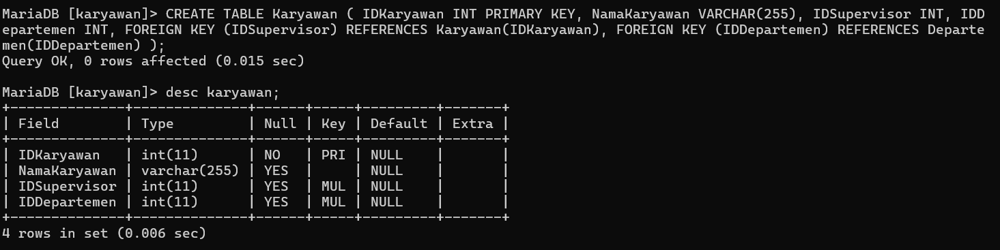
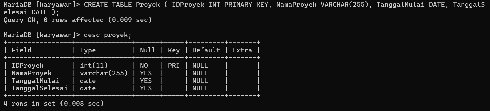
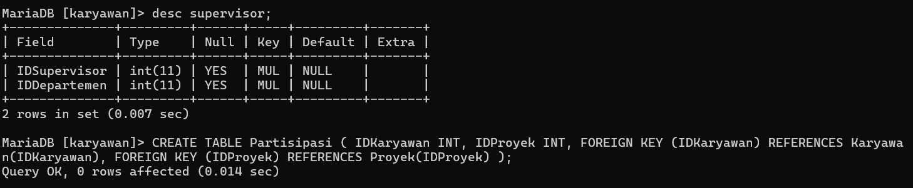
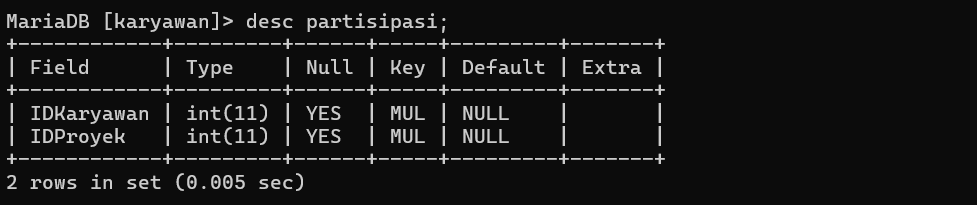

# Tugas Praktikum { Pertemuan ke 13 } 


|**Nama**|**NIM**|**Kelas**|**Matkul**|
|----|---|-----|------|
|ALVIN ALFANDY|312310473|TI.23.A.5|Basis Data|

# Studi Kasus: ERD Karyawan

## Soal Latihan

Sebuah perusahaan ingin membuat sistem untuk pengeloalaan data karyawan pada perusahaan , dengan ketentuan sebagai berikut :

-  Perusahaan tersebut terdiri dari beberapa depatemen yang di pimpin oleh seorang manager (Manajer merupakan bagian dari karyawan).

-  Karyawan bekerja pada salah satu departemen.

-  Karyawan memiliki atasan langsung seorang supervisor.

-  Seorang supervisor dapat membawahi dapat karyawan.

-  Setiap karyawan dari lintas departemen dapat bekerja pada satu project yang sama dalam satu waktu.

-  Setiap karyawan dapat mengerjakan beberapa project yang berbeda.

Buatlah desain databasenya (ER-Diagram), beserta tabel datanya ?

# ERD


# PENGOLAHAN DATA KARYAWAN
# Tabel Departement

# Di bawah ini merupakan perintah dan juga hasil yang di minta
````
CREATE TABLE Departemen ( IDDepartemen INT PRIMARY KEY, NamaDepartemen VARCHAR(255) );
````


## Tabel Karyawan
### Selanjutnya adalah table karyawan dengan menggunakan perintah seperti di bawah ini beserta hasil

````
CREATE TABLE Karyawan ( IDKaryawan INT PRIMARY KEY, NamaKaryawan VARCHAR(255), IDSupervisor INT, IDDepartemen INT, FOREIGN KEY (IDSupervisor) REFERENCES Karyawan(IDKaryawan), FOREIGN KEY (IDDepartemen) REFERENCES Departemen(IDDepartemen) );
````


## Tabel Proyek
### Kemudian kita akan melanjutkan pada tabel proyek dengan menggunakan perintah sepert di bawah ini beserta hasilnya

````
CREATE TABLE Proyek ( IDProyek INT PRIMARY KEY, NamaProyek VARCHAR(255), TanggalMulai DATE, TanggalSelesai DATE );
````


## Tabel Supervisor
### Kemudian kita akan melanjutkan pada tabel supervisor dengan menggunakan perintah sepert di bawah ini beserta hasilnya

````
CREATE TABLE Supervisor ( IDSupervisor INT, IDDepartemen INT, FOREIGN KEY (IDSupervisor) REFERENCES Karyawan(IDKaryawan), FOREIGN KEY (IDDepartemen) REFERENCES Departemen(IDDepartemen) );
````


## Table Partisipasi
### Kemudian kita akan melanjutkan pada tabel partisipasi dengan menggunakan perintah sepert di bawah ini beserta hasilnya

````
CREATE TABLE Partisipasi ( IDKaryawan INT, IDProyek INT, FOREIGN KEY (IDKaryawan) REFERENCES Karyawan(IDKaryawan), FOREIGN KEY (IDProyek) REFERENCES Proyek(IDProyek) );
````

